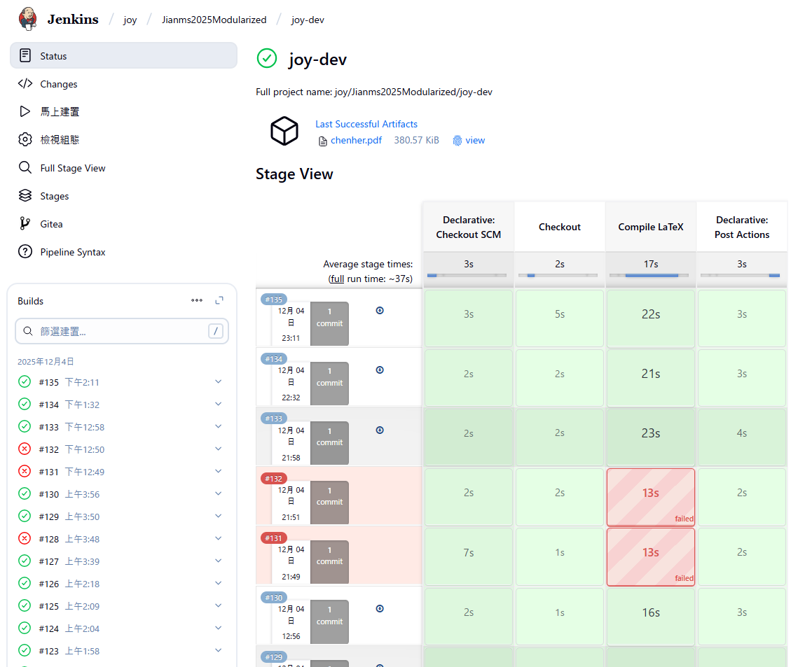
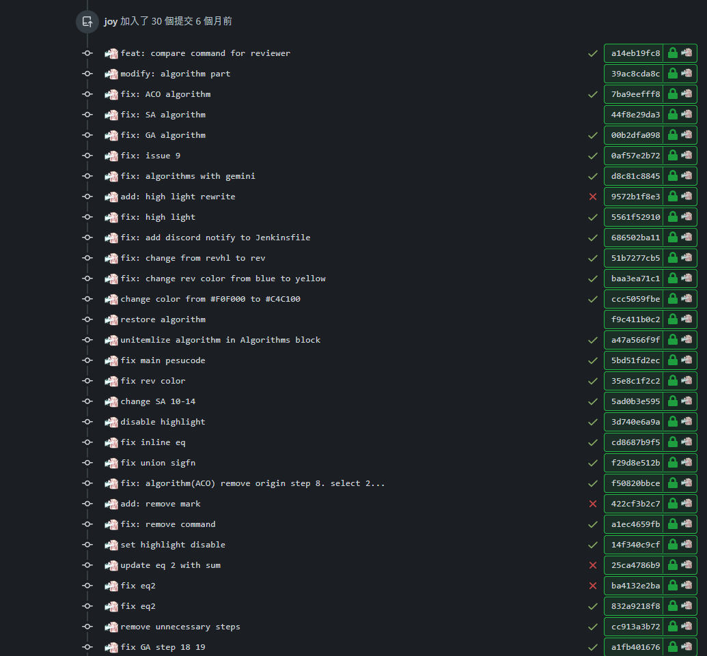

# CI/CD

When git repository has new commit and pushed to server the jenkins will automaticity build the case.

Due to the article will be edit after editor revise, to reduce the duplicate steps, the jenkins pipeline is a good choice to
save time.

